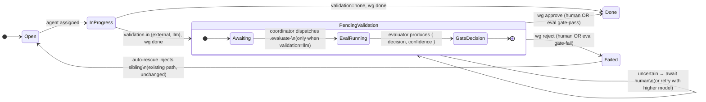

# LLM Verification Gate — Design

**Date**: 2026-04-22
**Task**: design-llm-based
**Inputs**:
- [shell-verify-vs-llm-eval-gap.md](../research/shell-verify-vs-llm-eval-gap.md) (research-shell-verify)
- [verify-deprecation-plan.md](./verify-deprecation-plan.md) (design-verify-deprecation)
- [verify-deprecation-survey.md](../research/verify-deprecation-survey.md)

---

## Executive summary

Introduce a per-task opt-in `validation = "llm"` mode that reuses the
existing `PendingValidation` machinery. On `wg done`, a task with this
mode transitions to `PendingValidation`; the coordinator dispatches the
existing `.evaluate-<id>` task; the evaluator produces a structured
`{ decision, confidence, score, rationale }` record and calls
`wg approve` or `wg reject` on the source based on the decision and
configurable thresholds. Uncertain results hold the task in
`PendingValidation` for human adjudication.

No new task status, no new coordinator phase, no replacement of
`--verify` (which the deprecation plan is already removing). The design
slots in as a third validation mode parallel to `external` and
`integrated`, and reuses the existing `wg approve` / `wg reject`
transitions.

**Decision summary**: **augment with per-task choice**, not replace.

---

## Design questions

### 1. Surface — how does a task opt in?

**Primary mechanism: `task.validation = "llm"`.** The `Task.validation`
field already exists (`src/graph.rs:375`) and already accepts
`"integrated"` and `"external"`. Adding `"llm"` is a new enum value, not
a new field.

CLI surface:

```
wg add "Refine the prompt" --validation llm
wg add "Research X"        --validation llm --validator-agent abc123
wg edit <task>             --validation llm
```

Additional triggers (for backward-compatible + ergonomic use):

- **Tag-driven default**: tasks tagged `eval-gate` (already the existing
  opt-in tag for `auto_rescue_on_eval_fail`) default to
  `validation = "llm"` when no explicit validation mode is set. This
  folds today's `eval-gate` users into the new system without a schema
  migration.
- **Role-driven default**: certain agency roles may set an implicit
  default (e.g., "Researcher" → llm, "Programmer" → none). This is a
  soft policy handled in `src/commands/add.rs` when both role and no
  explicit validation are set; tasks stay free to override.
- **Config-driven global**: a new `config.agency.default_validation_mode`
  (optional, default `None`) allows a project to opt every task in
  globally; per-task overrides win.

Non-surface: **not** a CLI flag `--llm-verify` that shells out at
`wg done`. The gate runs via the existing coordinator-dispatched
evaluator, not inline in the `wg done` process. This keeps the
synchronous `wg done` path fast and avoids blocking the agent.

Non-surface: **not** the default when `--verify` is absent. The
deprecation plan removes `--verify` entirely; the new default stays
`validation = "none"` (no gate) unless the task explicitly opts in. This
preserves the "most tasks don't need a gate" property documented in the
gap analysis §6.

### 2. Evaluator selection — which agency primitive runs the gate?

**Reuse the existing evaluator pipeline, with per-task override.**

Selection order (first hit wins):

1. `task.validator_agent` — new optional field, content-hash agent id,
   set via `wg add --validator-agent <hash>` / `wg edit`. Lets a
   specific task pin a specific evaluator (e.g., "security-sensitive
   refactor → SecurityReviewer").
2. `config.agency.evaluator_agent` — already exists
   (`src/config.rs:2287`). Today used by `.evaluate-<id>` tasks. Same
   mechanism.
3. **Fallback**: the agency assigner picks the highest-scoring agent
   whose role's desired_outcome matches `"Verified, correct work"` (a
   new standard outcome seeded by `wg agency init`). If no such role
   exists yet, falls back to the role with the best overall
   `by-task-type = "evaluate"` score from `wg agency stats`.

**Why not the task's assigned agent?** Self-verification defeats the
gate — the research §1 shows the shell `--verify` failure mode exactly
because agents produce the criteria that judge their own work. The LLM
gate is explicitly an independent-reviewer model, so the evaluator must
not be the same agent-content-hash as the source task's agent.

**Why not a hard-coded "Verifier" role?** Agency roles are
content-addressed and evolvable; baking one in breaks the evolution
loop. Instead, `wg agency init` seeds a role named "Verifier" with a
"Verified, correct work" outcome; `wg evolve run` can refine or retire
it; the selection logic references it by outcome, not by name.

**Dedicated vs. shared evaluator**: the existing `.evaluate-<id>` task
already carries the evaluator identity. For `validation = "llm"` the
same task is reused; a second task is NOT created. This keeps one
evaluation record per source task regardless of whether the evaluation
was post-hoc or gating.

### 3. Decision contract — inputs, outputs, uncertainty

#### Inputs

The evaluator prompt already assembles most of what's needed
(`src/commands/evaluate.rs:286-311`, reproduced in research §2). For the
gate, reuse `EvaluatorInput` unchanged, with three additions:

| Field | Source | Why |
|---|---|---|
| `validation_block` | Parsed from `task.description` (the `## Validation` section) | Agent-authored acceptance criteria; the gate's primary checklist |
| `downstream_consumers` | Already included via `task.before` titles/descriptions | Helps the evaluator judge whether the artifact will actually unblock downstream |
| `gate_mode: true` | Synthetic, set by the gate-dispatch path | Signals that the evaluator must produce a pass/fail decision, not just a score |

The artifact diff, logs, role, tradeoff, outcome, FLIP score, and agent
identity are already present in `EvaluatorInput`.

#### Outputs

Extend the existing `EvalOutput` (not replace) with a gate-specific
shape:

```json
{
  "score": 0.0-1.0,
  "dimensions": { "correctness": 0.9, "completeness": 0.8, ... },
  "notes": "free-text rationale",

  "gate": {
    "decision": "pass" | "fail" | "uncertain",
    "confidence": 0.0-1.0,
    "must_fix": [ "specific blocker 1", "specific blocker 2" ],
    "nice_to_have": [ "optional improvement 1" ]
  }
}
```

The `gate` object is only emitted when `gate_mode: true` was in the
prompt. Backward-compatibility: existing post-hoc evaluators omit it,
existing consumers ignore it.

Deterministic mapping from `gate` to transition:

| decision | confidence threshold | action |
|---|---|---|
| `pass`      | ≥ `eval_gate_threshold` (default 0.7) | `wg approve` source |
| `fail`      | ≥ `eval_gate_threshold`               | `wg reject` source with `must_fix` as reason |
| `uncertain` | any                                   | stay `PendingValidation`, emit a human-adjudication request |
| `pass`      | < `eval_gate_threshold`               | escalate (same as uncertain) |
| `fail`      | < `eval_gate_threshold`               | escalate (same as uncertain) |

#### Uncertainty handling

Three configurable behaviors (`config.agency.gate_uncertain_policy`,
default `escalate`):

- `escalate` (default): task stays `PendingValidation`; a
  `wg telegram send` notification fires if Telegram is configured; the
  task shows up in `wg list --status pending-validation` for human
  `wg approve` / `wg reject`.
- `retry`: the gate records the uncertain verdict, bumps a new
  `task.gate_attempts` counter, and re-runs the eval up to
  `config.agency.gate_max_attempts` (default 2) with a higher-tier
  model. Helps when the first-pass model was undersized.
- `fail-closed`: treat uncertain as reject. Cheapest; loses work if the
  evaluator is unsure.

Escalate is the safe default because uncertain verdicts are almost
always either (a) under-specified `## Validation` blocks, which a human
review can sharpen, or (b) genuinely ambiguous artifacts where a human
decision is warranted. Fail-closed is appropriate only for
high-trust-cost domains (e.g., security-critical code).

### 4. State machine

`PendingValidation` is reused; no new status is introduced.



Textual form:

```
InProgress
   │
   ├── validation = "none"       ──▶ Done   (fast path; no gate)
   ├── validation = "integrated" ──▶ Done   (shell validation_commands; existing)
   │
   ├── validation = "external"   ──▶ PendingValidation
   │                                   │
   │                                   ├─ wg approve (human) ──▶ Done
   │                                   └─ wg reject  (human) ──▶ Failed
   │
   └── validation = "llm"        ──▶ PendingValidation
                                       │
                                       ▼
                         coordinator dispatches .evaluate-<id>
                                       │
                                       ▼
                            evaluator produces gate record
                                       │
            ┌──────────────────────────┼──────────────────────────┐
            ▼                          ▼                          ▼
     decision=pass,         decision=fail,                decision=uncertain
     confidence≥threshold   confidence≥threshold          (or low confidence)
            │                          │                          │
            ▼                          ▼                          ▼
     wg approve              wg reject + must_fix          stay PendingValidation
     (auto)                  (auto; rescue injected)       await human approve/reject
            │                          │                          │
            ▼                          ▼                          ▼
          Done                       Failed                  (human decides)
                                       │
                                       ▼
                           auto-rescue Parallel task
                           (existing auto_rescue path,
                            unchanged)
```

#### Relationship to `--verify`

The deprecation plan (T2) hard-removes `--verify` and its gate logic
before this design lands. This design does not touch `--verify`; it
adds `validation = "llm"` to the surviving validation-mode machinery.

#### Relationship to `## Validation` block

The `## Validation` section in the task description remains
agent-facing self-check. When `validation = "llm"`, it becomes the
primary input to the evaluator prompt's gate logic. The block's format
is agent-authored prose; the evaluator does not require it to parse as
structured data, but a well-formed block improves gate accuracy.

#### Relationship to `auto_rescue_on_eval_fail`

The existing post-hoc flow (evaluation scores a `Done` task; if below
threshold, `run_eval_reject` + `rescue::run` inject a parallel rescue)
is **unchanged**. `auto_rescue_on_eval_fail` continues to operate on
tasks that were never gated (validation = "none" or "integrated"). For
`validation = "llm"` tasks, the gate decision drives approve/reject
directly, so the auto-rescue path is only reached on a `reject`
(equivalent to `run_eval_reject` on a `Done` task today); the rescue
injection still happens, giving the cycle its recovery behavior.

### 5. Cost control

LLM verification costs money; the design bounds spend on five axes.

1. **Per-task opt-in.** Most tasks don't pay the cost. The
   research §4 data shows only ~25% of tasks have any `verify` at all
   today; `validation = "llm"` will likely be a similar minority.

2. **Model tier per task.** New field `task.validator_model`
   (optional), parallel to the existing `task.model`. Resolution order:
   `task.validator_model` > `config.agency.evaluator_model` > the
   source task's own `task.model` > coordinator default. Lets
   cost-sensitive tasks gate with `haiku` while letting high-stakes
   tasks gate with `opus`.

3. **Result cache.** Keyed by
   `sha256(task_id || "|" || artifact_diff_hash)`, stored alongside
   the evaluation YAML in `.workgraph/agency/evaluations/`. If a retry
   re-enters `PendingValidation` with an identical diff hash, the
   cached gate record is reused with a `cache_hit: true` flag. Agents
   rarely resubmit byte-identical work, so hits will be rare, but the
   cache cheaply prevents oscillation loops.

4. **Attempt budget.** `task.gate_attempts` counter +
   `config.agency.gate_max_attempts` (default 2). Exceeding the budget
   forces the task into the `escalate` path regardless of
   `gate_uncertain_policy`.

5. **Integrated-first composition.** When `validation = "llm"` AND
   `validation_commands` is non-empty, the gate runs `integrated`
   first: shell commands must pass, then LLM gate runs. If shell fails,
   LLM gate is skipped (saving tokens) and the task rejects via
   standard integrated-validation failure. This mirrors the common
   engineering pattern "cheap test gates expensive test".

   Representation: introduce `validation = "llm"` as primary mode; when
   shell pre-checks are desired, the task sets both `validation = "llm"`
   and `validation_commands = [...]`, and the done-path runs integrated
   validation first (the existing block at `done.rs:1226-1272`) before
   falling through to the llm transition.

**Not done: skip if shell verify passed.** The research recommends
this, but the deprecation plan removes shell verify entirely before
this design lands. The equivalent is the integrated-first rule in (5).

### 6. Migration

The deprecation plan (`verify-deprecation-plan.md` T2) hard-removes
`--verify` as a prerequisite for this design. Ordering:

```
┌───────────────────────────────────────────────────────────────────┐
│ design-verify-deprecation (done)                                  │
│        │                                                          │
│        ▼                                                          │
│ T1..T5 of deprecation plan (in-flight / implementation tasks)     │
│        │ (rip lands; --verify gone; validation=external survives) │
│        ▼                                                          │
│ design-llm-based (THIS DOC)                                       │
│        │                                                          │
│        ▼                                                          │
│ implement-llm-verification (next downstream task)                 │
└───────────────────────────────────────────────────────────────────┘
```

Consequences:

- **No coexistence with `--verify`.** By the time this design is
  implemented, `task.verify` no longer exists in the schema. The gate
  does not need to "also check shell verify" or reconcile two sources
  of truth.
- **Coexistence with `validation = "external"`.** Both modes use
  `PendingValidation`. `external` requires human `wg approve`; `llm`
  auto-approves based on the gate decision (with human as fallback for
  uncertain). A task sets exactly one mode.
- **Coexistence with `auto_rescue_on_eval_fail`.** See §4; the
  post-hoc path remains independent.
- **Existing `eval-gate` tag users.** Migrate cleanly: tag-driven
  default (§1) means `eval-gate`-tagged tasks without explicit
  validation mode get `validation = "llm"` automatically.
- **Existing post-hoc `.evaluate-<id>` workflows.** Unchanged. Tasks
  with `validation = "none"` still get a post-hoc `.evaluate-<id>`
  spawned by the coordinator, which scores and optionally triggers
  `auto_rescue_on_eval_fail`. Only `validation = "llm"` teaches the
  evaluator to also call `wg approve` / `wg reject`.

No graph-level migration is required: `task.validation` already has
`Option<String>` semantics with `None` ≡ `"none"`; adding a new enum
value is forward-compatible with older graphs.

---

## API surface specification

### CLI flags

**`wg add`** (and `wg edit`):
```
--validation <mode>         # "none" | "integrated" | "external" | "llm"
                            # (extended: llm is new; others exist today)
--validator-agent <hash>    # NEW: pin a specific evaluator agent for this task
--validator-model <tier>    # NEW: override model tier for the gate eval only
--validation-command <cmd>  # existing; may be supplied alongside --validation llm
                            # (runs before the LLM gate; see §5)
```

**`wg approve`** / **`wg reject`**: unchanged. Both work on any
`PendingValidation` task regardless of mode. Humans retain ultimate
override.

**New**: `wg approve --by-eval <eval-id>` / `wg reject --by-eval <eval-id> [--reason ...]`.
Optional provenance flag that annotates the log entry with the
originating evaluation record id, so the audit trail distinguishes
human from LLM decisions. Both forms continue to work without the flag.

### Task schema additions

New fields on `Task` (all `Option<T>`, forward-compatible):

```rust
pub struct Task {
    // ... existing fields ...

    /// Extended: existing modes "integrated" and "external", plus new "llm".
    pub validation: Option<String>,

    /// Optional pin for which agent runs the LLM gate for this task.
    /// When None, resolution falls through config.agency.evaluator_agent
    /// and then the assigner default.
    pub validator_agent: Option<String>,

    /// Optional model override for the gate eval call only.
    /// Resolution: validator_model > config.agency.evaluator_model > task.model.
    pub validator_model: Option<String>,

    /// Attempt counter for gate evaluations. Increments each time the gate
    /// runs (pass OR uncertain). Used against config.agency.gate_max_attempts
    /// to bound cost on oscillation.
    #[serde(default)]
    pub gate_attempts: u32,
}
```

### Config additions (`src/config.rs` `[agency]`)

```toml
[agency]
# Existing:
# evaluator_agent = "<hash>"
# eval_gate_threshold = 0.7
# eval_gate_all = false
# auto_rescue_on_eval_fail = true

# New:
evaluator_model = "sonnet"               # Default model tier for gate + post-hoc evals
default_validation_mode = "none"         # "none" | "llm" | "external" | "integrated"
gate_uncertain_policy = "escalate"       # "escalate" | "retry" | "fail-closed"
gate_max_attempts = 2                    # Retry budget per task for uncertain verdicts
gate_confidence_threshold = 0.7          # Confidence floor for auto approve/reject
                                         # (parallel to eval_gate_threshold, which
                                         #  governs score)
```

### Evaluation record additions

`Evaluation` (the yaml artifact in `.workgraph/agency/evaluations/`)
gains an optional `gate` section:

```yaml
# Existing fields...
score: 0.82
dimensions:
  correctness: 0.9
  completeness: 0.8
notes: ...
source: "agent-abc..."

# New (present only when gate_mode was set):
gate:
  decision: "pass"            # "pass" | "fail" | "uncertain"
  confidence: 0.88
  must_fix: []
  nice_to_have: ["document the error path"]
  artifact_diff_hash: "sha256:..."   # for cache keying
  cache_hit: false
```

### New internal primitives (no user-facing surface beyond flags above)

- `run_gate_eval(task_id, config) -> GateResult` in
  `src/commands/evaluate.rs`: thin wrapper around the existing
  `evaluate::run` that sets `gate_mode: true` on the prompt and
  returns the structured `gate` record instead of `EvalOutput`.
- `apply_gate_decision(dir, task_id, gate) -> Result<()>` in
  `src/commands/evaluate.rs`: calls `approve::run`, `reject::run`, or
  leaves the task `PendingValidation` based on `gate.decision` and the
  threshold policy.
- A branch in `build_auto_evaluate_tasks`
  (`src/commands/service/coordinator.rs:1556`) that, for tasks in
  `PendingValidation` with `validation = "llm"`, seeds the
  `.evaluate-<id>` task with a `gate_mode` marker so the evaluator
  knows to produce the gate record and call back to
  `apply_gate_decision` on completion.

### Decision: **augment with per-task choice**

The gate is **not** a global replacement for anything. It coexists with
`validation = "external"` (human gate), `validation = "integrated"`
(shell validation_commands), and `validation = "none"` (no gate,
default). A task picks one mode. The design does not enable the LLM
gate implicitly for tasks that didn't opt in, except via the
`eval-gate` tag default (§1) which has the same semantics as today's
eval-gate system (just renamed as the trigger for the new machinery).

---

## Integration points from the research

Re-using the research table (gap-analysis §5), annotated with which
hooks this design touches:

| # | Hook | Touched by this design? |
|---|---|---|
| 1 | `wg add` / `wg edit` create-time lint | No — the `## Validation` block is free-form |
| 2 | Agent prompt injection | Minor: add "Your work will be gated by LLM evaluation" line when `validation = "llm"` |
| 3 | `wg done` inline gate (synchronous) | **No** — the design chose async PendingValidation |
| 4 | `wg done` PendingValidation transition (async) | **Yes** — extend `done.rs:1274-1348` with the `"llm"` branch |
| 5 | Coordinator dispatcher (`build_auto_evaluate_tasks`) | **Yes** — seed `gate_mode` on `.evaluate-<id>` for llm-gated tasks |
| 6 | `.evaluate-<id>` itself — add approve/reject calls | **Yes** — new `apply_gate_decision` invoked from evaluate.rs |
| 7 | FLIP injection | No — FLIP remains a separate signal; may feed `confidence` in a future revision |
| 8 | `wg approve` / `wg reject` CLI | Minor: new `--by-eval <eval-id>` provenance flag |

Total integration: hooks 4 + 5 + 6 (plus the cosmetic 2 and 8). The
research §5's "cleanest minimal integration: hook (4) + hook (6)" holds.

---

## Review against research findings

| Research finding | Design decision | Match |
|---|---|---|
| Per-task mode, not global (§6) | `validation = "llm"` is per-task; global default optional | ✓ |
| Reuse `PendingValidation` machinery (§3-4) | No new status; reuse external-validation transitions | ✓ |
| Async preferred over sync at `wg done` (§3) | Async via coordinator-dispatched `.evaluate-<id>` | ✓ |
| Add explicit pass/fail contract on eval output (§3) | `gate.decision` field in `EvalOutput` | ✓ |
| Determinism via cache (§3) | `artifact_diff_hash` cache key, `cache_hit` flag | ✓ |
| Cost budget per task (§3) | `gate_max_attempts` + per-task `validator_model` | ✓ |
| Keep `## Validation` block as agent self-check (§6) | Unchanged; becomes primary gate input | ✓ |
| Keep `auto_rescue_on_eval_fail` as post-hoc revoke (§6) | Unchanged; runs independently of gate | ✓ |
| Do NOT replace `--verify` directly (§6) | Deprecation plan rips `--verify`; gate is separate | ✓ |
| Smart-verify removed per deprecation plan | Not reintroduced; `## Validation` + LLM gate is the natural successor | ✓ |
| ~72% of verify failures were buggy verify commands, not buggy code (§4) | The gate removes the "agent writes shell command" failure surface entirely — criteria live in the `## Validation` prose block, judged by an independent LLM | ✓ |

No findings contradict the design; no findings are unaddressed.

---

## Open questions (for implementation task)

These are decisions intentionally deferred to the implementation phase
so they can be tuned against real traffic:

1. **Default `gate_confidence_threshold`**: 0.7 matches
   `eval_gate_threshold` for uniformity, but the confidence and the
   score are distinct axes. May need empirical tuning.
2. **Prompt design for gate mode**: the existing
   `render_evaluator_prompt` produces a score-and-dimensions prompt; a
   small template addition for `gate_mode` is needed. Implementation
   task should A/B a few phrasings against recent Done tasks to confirm
   the `pass/fail/uncertain` distribution behaves sensibly.
3. **Telegram notification format** for escalated uncertain verdicts.
   Out of scope for this design; the hook is a single
   `wg telegram send` call.
4. **Interaction with FLIP**: FLIP (`intent_fidelity`) is already
   folded into `EvalOutput.dimensions`. Whether low FLIP should
   override a `pass` gate decision, or merely feed confidence, is a
   future refinement.
5. **Multi-agent deliberation**: for high-stakes tasks, the gate could
   dispatch multiple evaluator agents and consensus-vote. Out of scope
   here; the single-evaluator design is the MVP.

---

## No code changes

This document is a design artifact. Implementation is the downstream
task `implement-llm-verification`, which will wire the
`validation = "llm"` branch into `done.rs`, extend `evaluate.rs` with
the gate-mode prompt and `apply_gate_decision`, and add the
`build_auto_evaluate_tasks` marker for gate dispatch.
